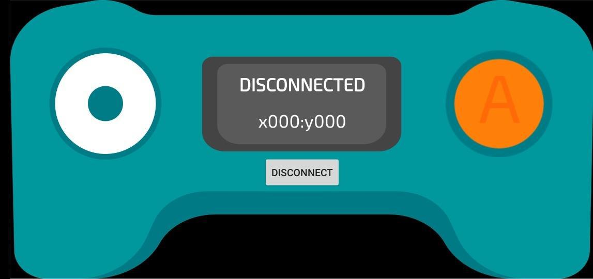
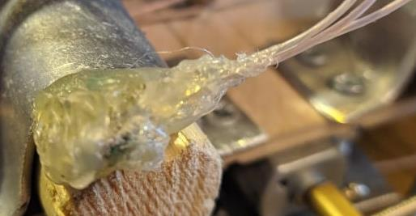

# Виброход

## Аннотация

Благодаря появлению перспектив колонизации других планет снова появилась потребность в новых средствах перемещения. В частности, они должны быть легкими, с минимальной потребностью в ремонте (а также с малой ценой ремонта), и обладать возможностью движения по пересеченной местности. Широко используемые гусеничные конструкции эффективны, но достаточно сложные, в условиях колонии их ремонт может быть затруднителен. Этот проект посвящен альтернативному средству передвижения, с крайне простыми конструкцией и принципом работы — виброходу.

На виброходе присутствует один или несколько источников вибрации, которые ее передают на "ноги". "Ноги", в свою очередь, за счет вибрации отталкиваются от поверхности, создавая движущую силу. У такого устройства низкий КПД и ограниченная скорость, однако (в зависимости от реализации) могут полностью отсутствовать движущиеся части, что на порядок увеличивает срок службы, а компоненты дешевые и легко заменяются.

Идея создания средств передвижения на основе вибрации возникла давно, однако в силу вышеперечисленных очевидных недостатков системы вкупе со сложностью управления всерьез ими никто не занимался. Хотя в сети иногда появляются статьи и видео о виброходах как "самоделках" или готовых игрушках из зубной щетки и вибромоторчика от старого телефона.

## Возможные улучшения

В качестве детской игрушки-жука виброход мало интересен. Если же задуматься о более серьезном применении, то в первую очередь встает проблема управления. Без возможности менять направление виброход становится бессмысленным, так как малейший дисбаланс приведет к движению по окружности. Было выявлено три основных способа управления:

- Изменение расположения центра масс виброхода. При его отклонении от положения, в котором не возникает вращения (момент сил — ноль) "ноги", в сторону которых происходит отклонение, начинают давать больший момент, за счет чего происходит поворот. В таком случае требуется либо "ездок", способный отклоняться, направляя виброход, либо специальный достаточно тяжелый груз, способный свободно перемещаться перпендикулярно движению. Первый вариант по понятным причинам проверить не было возможности. Во втором варианте уменьшается полезная нагрузка, а также требуется как минимум один мотор на изменение положения груза. Таким образом, в этом случае сильно падает и без того малый КПД, поэтому его исследование не было проведено.

- Изменение угла наклона "ног" виброхода. Для этого требуется большая система регулировки и поддержания угла, которая себя не оправдывает, вдобавок сильно усложняя конструкцию. 

- Изменение мощности источников вибрации. Самый простой способ, требующий только наличие нескольких источников с индивидуально регулируемым питанием. В случае высоких мощностей это требует индивидуального транзисторного каскада или реле, но это не сильно утяжеляет конструкцию

Также одним из недостатков, ухудшающих КПД виброхода, является  рассеивание вибрации на грузе (в случае пассажиров это еще грозит такими заболеваниями, как *вибрационная болезнь*). Однако этот недостаток можно исправить, изолировав платформу с источниками вибрации и "ноги"  от груза упругим слоем (с параметрами, подобранными под порядок амплитуды и частоты источников). К сожалению, это при своей простоте достаточно сложно реализовать на стадии эксперимента, поэтому изучить эффективность такого способа не удалось.

## Ход работы

В качестве источников вибрации были использованы обычные электрические моторы с осью, на которой на краю была несимметрично закреплена обычная стирательная резинка, специальный груз или винт.

### Первая модель

Для начала было решено попробовать создать предельно простую масштабную (размером со средний ноутбук) модель виброхода. При этом было решено проверить гипотезу о том, что виброход может двигаться, не имея упругих щетинок (которые сложно реализовать в большом масштабе), а имея только несколько (3-6) металлических "ноги". В данном случае были использованы обычные стальные шурупы. Корпус был собран из имевшейся под руками фанеры, управление состояло из одной кнопки на корпусе.

Посмотреть на работу можно [здесь](https://www.youtube.com/watch?v=EDAMhtYsdPM).

Модель подтвердила предположение, показала достаточно хорошую скорость при большом весе (в первую очередь за счет мощного мотора).

### Вторая модель

В следующей модели исследовалась возможность управления виброходом на двух более слабых моторах. Также хотелось попробовать менять углы "ног", изучить зависимость скорости от угла. Для этого были установлены три пластины с дырками для фиксации относительного положения (см. схему). Болт ("нога") плотно зажимается между краями дыр в пластине.

Модель была выполнена из текстолита, легкого упругого материала, хорошо передающего вибрацию. Программная часть реализована на [Miskatino](https://github.com/Miskatino/miskatino-basic) и дистанционно управлялась через Bluetooth.

Изобретенная система регулировки ног оказалась требующей слишком много сил на сборку и переустановку, оказалась недостаточно надежной и неуправляемой (давала неконтролируемые углы наклона).

На работу можно посмотреть [здесь](https://www.youtube.com/watch?v=1ATKHp72OKU) (единственное сохранившееся видео, на нем модель еще завершена).

В частности из-за этого управляемость этого виброхода оказалось недостаточной. К тому же система Miskatino + Bluetooth была достаточно ненадежной и плохо масштабируемой.

### Третья модель

В этой модели хотелось реализовать итоговую модель без недостатков предыдущих. Фанера показала себя лучше (и дешевле) текстолита, поэтому основа была выполнена из нее. Управление реализовано на базе Arduino + Bluetooth + Arduino Bluetooth Joystick (эмулятор джойстика на Android, см. ниже).

Левый джойстик отвечает за направление (ось "X") и скорость (ось "Y"), правая кнопка отвечает за режим "турбо".

[Здесь](https://gist.github.com/donRumata03/6ce5c4040cc19076b2c50ecba35349bf) находится исходный код виброхода (используется библиотека "Arduino.h").

На ходовой платформе из фанерной основы с помощью металлических алюминиевых скоб установлены деревянные цилиндры с
отверстиями под болты, заточенные со стороны, касающейся земли.      

  Для крепления моторов используется металлическая пластина. В  качестве контроллера используется Atmega328P на плате Arduino Uno. Для приёма Bluetooth сигнала подключен модуль HC-06.

<em>Слева направо: металлическая пластина, Arduino Uno, HC-06</em>

Для правильного использования контроллера требуется напряжение в 3.3 В. Для этого пришлось использовать делитель напряжения, который был упакован в термоклей. Источник питания — литиевый аккумулятор 2S на 7.2 Вольта, ток — до 20 А. В качестве источника вибрации используется электрический мотор постоянного тока PPN13KA11C с закрепленным винтом.

<em>Слева направо: делитель напряжения, аккумулятор, мотор с винтом</em>

Для плавного управления моторчиками используется ШИМ: контроллер
часть времени, зависящей от требуемой мощности, посылает высокий сигнал на выход, остальное
время — низкий. Из-за того, что выход контроллера имеет
ограниченный выходной ток (20 мА), недостаточный для работы
мотора, используются транзисторы D882, стандартно подключенные и работающие в
режимах насыщения и отсечки (по очереди). На базе стоят резисторы SMD 1кОм.

<em>Слева: схема работы моторов. Справа: реализация.</em>

 

<em>Слева: общий вид сверху. Справа: вид снизу.</em>

[Здесь](https://www.youtube.com/watch?v=rzdlhNdCZLE) можно посмотреть на работу виброхода.

Этот виброход в силу удобства использования использовался для проведения измерений. 

## Теория

Имея под рукой удобный в использовании виброход, можно теоретически вывести некоторые параметры и принципы. Во всех выводах будем брать виброход нашей модели с пренебрежимо малой сжимаемостью "ног". Источниками вибрации будут моторы с грузиками, вращающиеся в вертикальной плоскости вдоль оси движения. 

### Оценка скорости

Для начала рассмотрим виброход на одном источнике синусоидальной вибрации. Для оценки сверху будем считать, что вертикальные колебания ни на что не влияют (болты несжимаемы), а движение происходит за счет горизонтальных (вдоль оси движения). Наклонные "ноги" допускают движение только в нужную сторону (в общем случае это неправда, существует проскальзывание, однако с хорошей точностью выполняется и для оценки сверху годится).

Пусть мотор вращается с угловой скоростью *w*, центр масс груза расположен на расстоянии *R*, масса груза — *m*, масса всего виброхода (в случае наличия упругой изоляции от вибрации — масса платформы) — *M*. Скорость груза — *v = mw*.

Зависимость импульса груза по горизонтали от времени тогда принимает вид 
$$
p_x(t) = mv·sin(wt)=mwR·sin(wt)
$$
По закону сохранения импульса импульс всего виброхода/платформы (правда, с некоторыми потерями из-за трения), так как назад движение запрещается "ногами", будет иметь вид:

Из-за трения или полезной нагрузки синусоида может затухать до конца цикла, однако из-за ограничения движения назад последующие циклы от этого не изменятся. Причем при небольших затуханиях это практически не повлияет на средний импульс, который будет *mwR*. Соответственно, скорость сверху для одного мотора ограничена значением:

$$
v_{max} = \frac{mwR}{M}
$$
В случае нескольких несинхронизированных моторов скорость не будет просто складываться, так как возникает интерференция вибраций, из-за чего итоговая скорость существенно уменьшается. Однако, если они находятся на разных "шинах" (рядах "ног"), то доля вибрации от другого мотора на ногах по сравнению с вибрацией ближайшего будет не такой большой. Но такой эффект необходимо учитывать, в идеале изолируя шины друг от друга.

### Эффект обратного движения

На второй версии виброхода был замечен интересный эффект: если запустить мотор в противоположную сторону, виброход начинал двигаться в противоположную сторону, игнорируя противоположное положение "ног". Этот эффект весьма показателен, так как на его примере можно понять принцип действия виброхода более глубоко, отойдя от предыдущего объяснения "Ноги препятствуют движению в противоположную сторону". Попробуем полностью отказаться от этого утверждения.

Рассмотрим движение груза по окружности, например, по часовой стрелке (см. схему).

В положении `I` и `III` скорость виброхода (противоположна скорости груза) по горизонтали отсутствует. В `IV` она направлена вправо, в `II` — влево. В `IV` центростремительное ускорение направлено вверх, т.е. груз "тянет" виброход вниз. Аналогично в `II` сила груза направлена вверх. В `I` и `IV` вертикальная компонента отсутствует. Понятно, что в целом на участке `III - II - I` скорость также направлена влево, а движение груза "отжимает" виброход, уменьшая силу трения. Тогда сила трения направлена вправо, она слабее, чем если бы силу опоры создавал статичный виброход (фаза движения). На участке же `I - IV - III` скорость направлена вправо, движение "прижимает" виброход к поверхности, увеличивая силу трения. Сила трения направлена влево, она больше, чем была бы при обычном весе виброхода (фаза торможения). Таким образом, за весь цикл сила трения влево при том же времени действия и аналогичной зависимости от времени соответственно больше силы трения, толкающей вправо. Так как это единственная внешняя сила, то в целом виброход начинает двигаться влево. Но достаточно поменять направление вращения, и виброход поедет вправо (очевидно из симметрии модели).

В этом случае мы полностью откинули направленность "ног", но в реальной жизни важны и они тоже. В первую очередь, это зависит от их материала, размера, остроты, веса виброхода. В третьей модели проверялось это предположение, болты на "ногах" были заточены, отчего виброход стал передвигаться существенно быстрее. К сожалению, это приводило к повреждению поверхностей, то есть должен быть найден компромисс. 

Однако важно понимать, что такой механизм позволяет виброходу передвигаться без "ног" вовсе, или же имея толстые концы "ног". В теории это может позволить лучше передвигаться по мягким и сыпучим материалам, пусть и с потерей эффективности. 

Также это дает ответ на вопрос "какой оптимальный угол наклона «ног»": это зависит от геометрии самих ног, их материала и т.д. Угол должен быть подобран так, чтобы не мешать движению в нужную сторону, и максимально противодействовать движению в обратную.

#### Грузоподъемность

Сила, создающая центростремительное ускорение груза, будет по модулю:
$$
F_0 = ma=m·\frac{v^2}{R}=mw^2R
$$
Проекция на вертикаль и горизонталь:
$$
F_x = F_0·sin(wt)=mw^2R\ sin(wt)\\
F_y = F_0·sin(wt)=mw^2R\ cos(wt)
$$
На виброход в фазе движения действует вертикальная и горизонтальная компоненты силы от груза, ила тяжести и сила трения. Результирующая сила по горизонтали будет (*μ* — коэффициент трения):
$$
F = F_0·sin(wt)-μ(Mg-F_0·cos(wt))=F_0·sin(wt)+μF_0·cos(wt)-μMg=\\
= F_0\sqrt{1+μ^2}\Big(\frac1{\sqrt{1+μ^2}}·sin(wt)+\fracμ{\sqrt{1+μ^2}}·cos(wt)\Big)-μMg=\\
\sqsupsetφ=arcsin\Big(\frac{μ}{\sqrt{1+μ^2}}\Big)\\
= F_0\sqrt{1+μ^2}·sin(wt +φ)-μMg
$$
Будем считать нагрузку допустимой, если сила падает не больше чем в два раза. Т.е.
$$
μMg \le \frac12F_0\sqrt{1+μ^2}\\
M \le\frac12\frac{F_0}g\sqrt{1+\frac1{μ^2}} = \frac12\frac{mw^2R}g\sqrt{1+\frac1{μ^2}}
$$
Важно понимать, что здесь *M* — масса всего виброхода вместе с грузом, и никакая изоляция неспособна уменьшить это значение. Однако это значение массы на одну платформу, при отсутствии вибрационной интерференции достаточно просто добавлять дополнительные платформы и равномерно распределять нагрузку между ними.

### Движение вверх по наклонной поверхности

Пусть есть наклонная плоскость с углом наклона *α* и коэффициентом трения *μ*. На виброход действуют те же силы, что и выше, повернутые на угол α, только сила тяжести заменяется проекцией на перпендикуляр к плоскости, по модулю *Mg · cos α*, а также второй его проекцией вдоль плоскости *Mg · sin α*. Итоговая сила в фазе движения будет:
$$
F = F_0·sin(wt)-μ(Mg·cos\ α-F_0·cos(wt))-Mg·sin\ α=\\=
F_0\sqrt{1+μ^2}·sin(wt +φ) - Mg(μ·cos\ α + sin\ α)=\\=
F_0\sqrt{1+μ^2}·sin(wt +φ) - Mg(μ·cos\ α + sin\ α)=\\=
F_0\sqrt{1+μ^2}·sin(wt +φ) - Mg\sqrt{1+μ^2}\big(sin\ φ·cos\ α + cos\ φ·sin\ α\big)=\\=
\sqrt{1+μ^2}\Big(F_0·sin(wt +φ) - Mg·sin(α+φ)\Big)
$$
Аналогично считая, что требуется не меньше половины от этой силы, получаем:
$$
Mg·sin(α+φ)\le\frac12F_0\\
sin(α+φ) \le \frac12\frac{F_0}{Mg}\\
α  \le arcsin\bigg(\frac12\frac{F_0}{Mg}\bigg) - φ=arcsin\bigg(\frac12\frac{mw^2R}{Mg}\bigg) - arcsin\Big(\frac{μ}{\sqrt{1+μ^2}}\Big)
$$
Это при условии, что ноги виброхода полностью блокируют движение в обратную сторону. Однако в реальной жизни возникает очень существенное на наклонных плоскостях проскальзывание, из-за которого такие теоретические результаты расходятся с практическими. При текущих параметрах виброхода и коэффициенте трения *μ = 0.3* это дает значение границы сверху для угла 30°, что существенно выше реальных результатов. Но такое теоретическое значение может быть достигнуто, если найдется способ полностью блокировать обратное движение (зубчатая поверхность или специальный механизм на "ногах"). 

### Параметры финальной версии виброхода

| Параметр                                                  | Значение  |
| --------------------------------------------------------- | --------- |
| Масса                                                     | 500 г (!) |
| Оценочная угловая частота вращения двигателей с нагрузкой | 550 рад/с |
| Масса груза                                               | 5 г       |
| Расстояние от оси до груза                                | 5 мм      |
| Число моторов                                             | 2         |
| Скорость                                                  | 4 см/с    |
| Мощность мотора                                           | 180 мВт   |
| Дополнительный груз                                       | до 1 кг   |

Интересно заметить, что измеренная скорость виброхода (4 см/с) хорошо согласуется с теорией, согласно которой максимально достигаемая скорость при текущих параметрах — 5.5 см/с

### Общие оценки параметров

#### Скорость

Для крайне грубой оценки воспользуемся рядом утверждений без их обоснований, из "чувства здравого смысла". Масса груза одной платформы не может превышать 1/10 от общей массы платформы. Расстояние от оси до груза не может превышать 1/10 от общей длины (*L*). Угловая частота при таких параметрах вряд ли будет превышать 600 рад/с. Используя формулу максимальной скорости
$$
v_{max} =\frac{mwR}{M}=\frac1{10}·600\frac1с·\frac1{10}L\approx6\frac Lс
$$
Т.е. виброход физически не может развивать скорость, большую чем шесть собственных длин в секунду. Несложно подсчитать, что, например, для обычного автомобиля такой параметр составляет порядка (скорость — 100 км/ч = 360 м/с, длина — 5 м)  70 L/с.

То есть в 12 раз больше, чем максимум, потенциально доступный для виброходов.

#### Масштабирование

Мощность электрических моторов пропорциональна их объему. С другой стороны, она пропорциональна произведению скорости (которая, в свою очередь, пропорциональна радиусу груза, см.выше) и характерной силы (*mw²R*).

И если просто увеличить модель с сохранением пропорций, то мощность увеличится как куб длины, скорость должна вырасти линейно, а сила вырастет аж в четвертой степени (масса груза пропорциональна кубу, радиус пропорционален длине). Т.е. с одной стороны производимая мощность растет как куб, а потребляемая — как пятая степень. Это приведет к недостатку мощности, что потребует увеличения массы моторов, от чего будет и дальше падать эффективность. Можно уменьшать угловую частоту, так как потребление зависит от нее как от квадрата, а скорость — линейно, но в этом случае придется смириться с уменьшением перевозимой массы как квадрата. Таким образом, виброходы показывают практически невозможность создавать крупные модели. Однако это работает и в другую сторону — при уменьшении модели необходимая массовая доля электромотора падает при сохранении всех параметров, что увеличивает эффективность. В связи с этим можно предположить, что виброходы могут найти применение в логистике микроскопических масштабов, благодаря их простоте и большой перевозимой массе.

## Выводы

 Несомненно, виброход — крайне интересная модель, как с точки зрения физики (в первую очередь механики), так и с позиций сборки и создания ПО. В силу своего принципа действия (как показано в этой работе) как самостоятельное средство передвижения они обладают низкими параметрами по сравнению с более популярными транспортными средствами. Однако отдельные идеи и концепции вполне могут оказаться полезными и вне концепции виброхода.

---

## Над проектом работали

**Владимир Латыпов**: сборка и обсуждение всех реализаций виброхода.

**Андрей Ситников**: участвовал в обсуждениях и сборке первой и второй версии виброхода.

**Родион Сергеевич Горковенко**: идея, научный руководитель.

